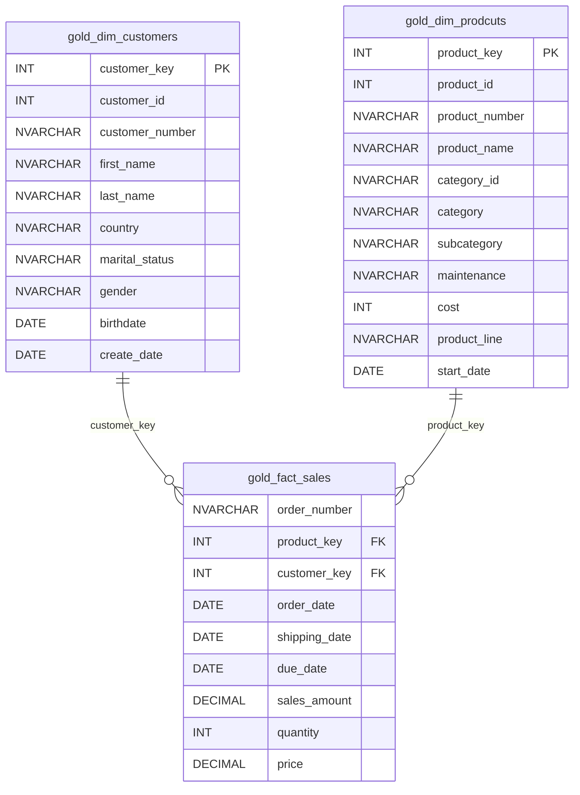

# Data Dictionary for Gold Layer

## Overview

The Gold Layer is the business-level data representation, structured to support analytical and reporting use cases. It consists of **dimension tables** and **fact tables** for specific business metrics.

---

## 1. `gold.dim_customers`

- **Purpose:** Stores customer details enriched with demographic and geographic data.
- **Type:** Dimension Table

### Columns

| Column Name | Data Type | Description |
|---|---|---|
| `customer_key` | INT | Surrogate key uniquely identifying each customer record in the dimension table. |
| `customer_id` | INT | Unique numerical identifier assigned to each customer. |
| `customer_number` | NVARCHAR(50) | Alphanumeric identifier representing the customer, used for tracking and referencing. |
| `first_name` | NVARCHAR(50) | The customer's first name, as recorded in the system. |
| `last_name` | NVARCHAR(50) | The customer's last name or family name. |
| `country` | NVARCHAR(50) | The country of residence for the customer. |
| `marital_status` | NVARCHAR(50) | The marital status of the customer. |
| `gender` | NVARCHAR(50) | The gender of the customer, using CRM data when available and ERP data as a fallback. |
| `birthdate` | DATE | The customer's date of birth. |
| `create_date` | DATE | The date when the customer record was created. |

---

## 2. `gold.dim_prodcuts`

- **Purpose:** Stores current product details enriched with category and subcategory information.
- **Type:** Dimension Table

### Columns

| Column Name | Data Type | Description |
|---|---|---|
| `product_key` | INT | Surrogate key uniquely identifying each product record in the dimension table. |
| `product_id` | INT | Unique numerical identifier assigned to the product. |
| `product_number` | NVARCHAR(50) | Alphanumeric identifier representing the product, used for tracking and referencing. |
| `product_name` | NVARCHAR(100) | Name or description of the product. |
| `category_id` | NVARCHAR(50) | Unique identifier of the product category. |
| `category` | NVARCHAR(50) | High-level category to which the product belongs. |
| `subcategory` | NVARCHAR(50) | More specific classification of the product within its category. |
| `maintenance` | NVARCHAR(50) | Maintenance classification or requirement associated with the product. |
| `cost` | INT | Cost associated with the product. |
| `product_line` | NVARCHAR(50) | Product line or business grouping associated with the product. |
| `start_date` | DATE | Date from which the current product record is valid. |

---

## 3. `gold.fact_sales`

- **Purpose:** Stores sales transaction data used for business analysis and reporting.
- **Type:** Fact Table

### Columns

| Column Name | Data Type | Description |
|---|---|---|
| `order_number` | NVARCHAR(50) | Unique identifier of the sales order. |
| `product_key` | INT | Foreign key referencing the `product_key` in the product dimension. |
| `customer_key` | INT | Foreign key referencing the `customer_key` in the customer dimension. |
| `order_date` | DATE | Date when the sales order was placed. |
| `shipping_date` | DATE | Date when the sales order was shipped. |
| `due_date` | DATE | Expected delivery or due date of the sales order. |
| `sales_amount` | DECIMAL | Total sales amount associated with the sales transaction. |
| `quantity` | INT | Number of units sold in the transaction. |
| `price` | DECIMAL | Selling price per unit. |

---

## Data Model

The Gold Layer follows a **Star Schema** consisting of two dimension tables and one central fact table.

### Relationships

- `gold.dim_customers.customer_key` → `gold.fact_sales.customer_key`
- `gold.dim_prodcuts.product_key` → `gold.fact_sales.product_key`
- `dim_customers` and `dim_prodcuts` are **dimension tables**.
- `fact_sales` is the **central fact table** containing sales transactions and measurable business metrics.
